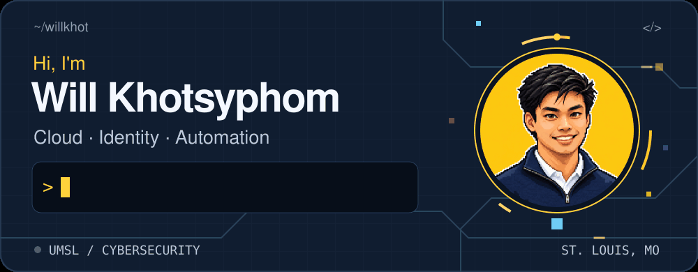

<!-- Upload this README and the assets folder together to willkhot/willkhot. -->
<picture>
  <source media="(prefers-reduced-motion: reduce)" srcset="assets/hero-still.png">
  
</picture>

  <a href="https://willkhot.github.io/"><strong>Portfolio ↗</strong></a> &nbsp;·&nbsp;
  <a href="https://www.linkedin.com/in/will-khotsyphom"><strong>LinkedIn ↗</strong></a> &nbsp;·&nbsp;
  <a href="https://github.com/willkhot/linux-cloud-iam-labs"><strong>Explore my labs ↗</strong></a>

## A little about me

I like figuring out how systems work, making them more secure, and automating the repetitive parts. This is where I share what I'm building and learning.

- 🎓 **B.S. Cybersecurity, IT emphasis** · UMSL · **4.0 GPA** · Expected December 2027.
- 💼 **Former IT Intern, Fabick CAT** · Azure automation, IAM, Windows Server/Exchange, and IT support.
- ☁️ **AZ-900 certified** · **SC-300 in progress**.
- 🛠️ Currently exploring **Linux networking, cloud security, and CI/CD**.

## My toolbox

  
  
  
  
  
  
  
  
  

**Also worked with:** Active Directory · Microsoft 365 · Defender · Wireshark · VS Code

